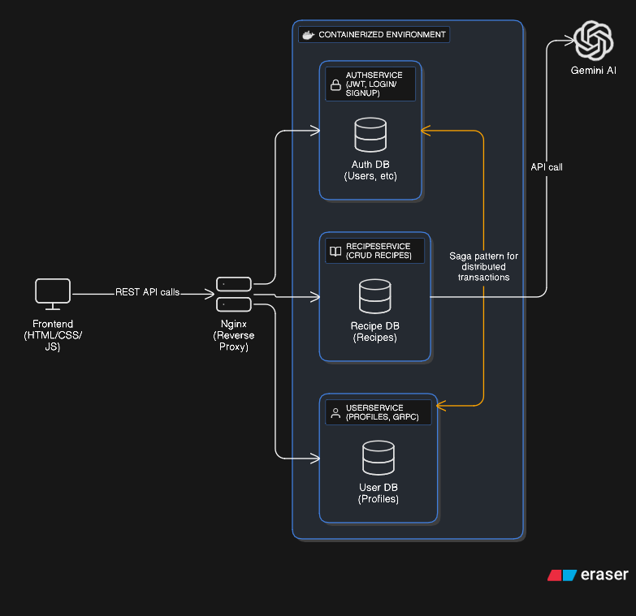

# Flavor-AI

## 📌 Project Description

Flavor-AI is an **AI-powered recipe recommendation platform** that helps users discover new meals based on their available ingredients, dietary preferences, and nutritional needs.
The system is built with a **microservices architecture**, including authentication, user profile management, recipe generation, and pantry management.
It leverages AI models to suggest creative and healthy recipes, providing a seamless cooking experience for users.

---

## 📸 Screenshots

Arch



Here are some screenshots of the project:


---

## ⚙️ Setup Instructions

### 1. Prerequisites

* [Java 21](https://adoptium.net/) & Maven (for backend microservices)
* [Docker & Docker Compose](https://docs.docker.com/get-docker/)
* PostgreSQL

---

### 2. Clone the Repository

```bash
git clone https://github.com/BhushithaHashan/Flavor-AI.git
cd Flavor-AI
```

---

### 3. Backend Setup


1. Start services via Docker Compose:

   ```bash
   cd deploy
   docker-compose up --build
   ```

---

### 4. Frontend Setup

1. Navigate to frontend folder using your ide and use live server for testing

---

### 5. Access Application

* API Gateway: `http://localhost:8080`
* Frontend: `http://localhost:5500`

---

## 🎥 Demo Video

👉 [YouTube Demo Video – Flavor-AI](https://youtu.be/D_z2Si5npkY?si=UmmI9IweTpOGiuB3)
---

